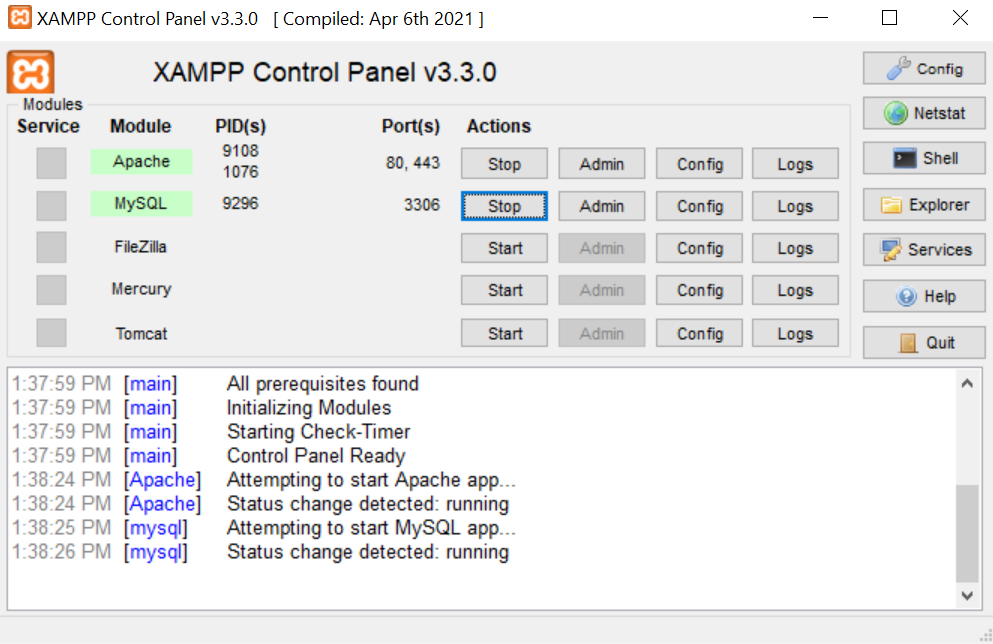
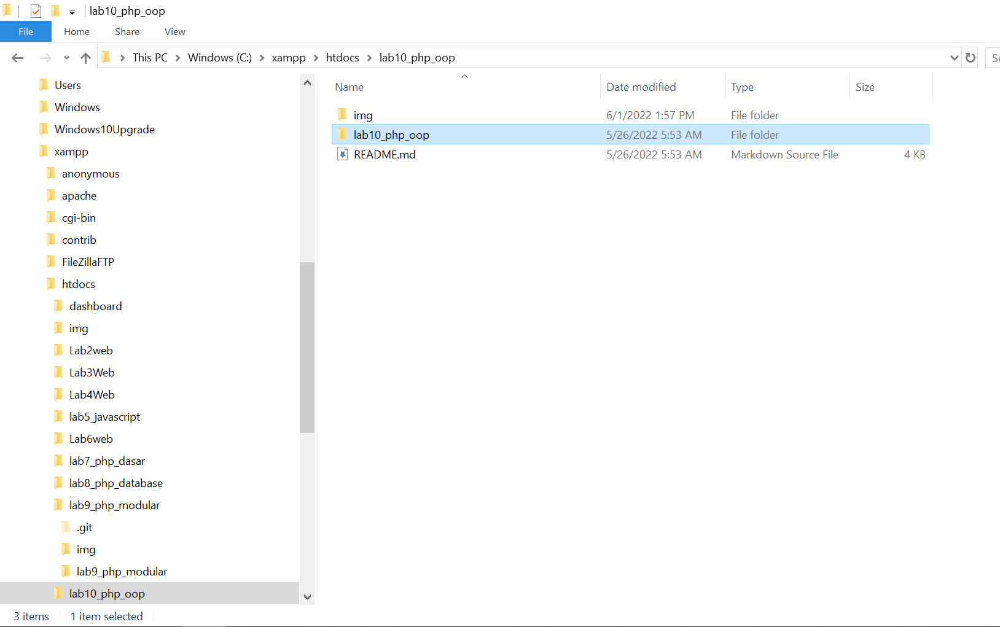
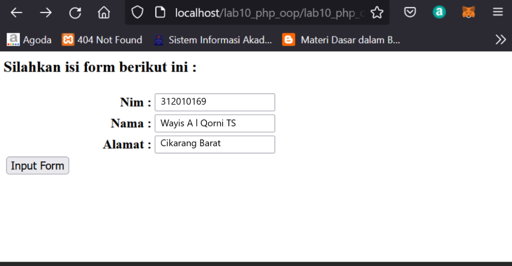

# Nama          : Wayis Al Qorni TS
# Nim           : 312010169
# Kelas         : TI.20.A1
# Mata Kuliah   : Pemrograman Web

# PERTEMUAN 11
# LAB 10 WEB

Dipertemuan kali ini kita akan mempelajari PHP OOP

# LANGKAH - LANGKAH 

# 1. MENJALANKAN XAMPP SERVER



PENJELASAN

Menjalankan xampp serve

# 2. BUAT FOLDER BARU DENGAN NAMA lab10_php_oop



PENJELASAN

Setelah itu jalankan dengan mengakses URL: http://localhost/Lab10Web/lab10_php_oop/

# 3.BUAT FILE BARU DENGAN NAMA mobil.php

PENJELASAN

Menggunakan class dan pemanggilan class
```php
code php

<?php
/**
* Program sederhana pendefinisian class dan pemanggilan class.
**/

class Mobil
{
    private $warna;
    private $merk;
    private $harga;

    public function __construct()
    {
        $this->warna = "Biru";
        $this->merk = "BMW";
        $this->harga = "10000000";
    }
    
    public function gantiWarna ($warnaBaru)
    {
        $this->warna = $warnaBaru;
    }

    public function tampilWarna ()
    {
        echo "Warna mobilnya : " . $this->warna; 
    }
}

// membuat objek mobil
$a = new Mobil();
$b = new Mobil();

// memanggil objek
echo "<b>Mobil pertama</b><br>";
$a->tampilWarna();
echo "<br>Mobil pertama ganti warna<br>";
$a->gantiWarna("Merah");
$a->tampilWarna();

// memanggil objek
echo "<br><b>Mobil kedua</b><br>";
$b->gantiWarna("Hijau");
$b->tampilWarna();

?>
```
Dan ini adalah hasil outputnya


# 4.BUAT FILE BARU DENGAN NAMA form.php

 Dan ini adalah code php nya 

```php
<?php
/**
* Nama Class: Form
* Deskripsi: CLass untuk membuat form inputan text sederhana
**/

class Form
{
    private $fields = array();
    private $action;
    private $submit = "Submit Form";
    private $jumField = 0;

    public function __construct($action, $submit)
    {
        $this->action = $action;
        $this->submit = $submit;
    }
    
    public function displayForm()
    {
        echo "<form action='".$this->action."' method='POST'>";
        echo '<table width="100%" border="0">';
        for ($j=0; $j<count($this->fields); $j++) {
            echo "<tr><td align='right'>".$this->fields[$j]['label']."</td>";
            echo "<td><input type='text' name='".$this->fields[$j]['name']."'></td></tr>";
        }
        echo "<tr><td colspan='2'>";
        echo "<input type='submit' value='".$this->submit."'></td></tr>";
        echo "</table>";
    }

    public function addField($name, $label)
    {
        $this->fields [$this->jumField]['name'] = $name;
        $this->fields [$this->jumField]['label'] = $label;
        $this->jumField ++;
    }
}

?>
```
# 5.BUAT FILE BARU DENGAN NAMA form_input.php

PENJELASAN

Membuat metode input dengan include untuk target halaman
```php
code php

<?php
/**
* Program memanfaatkan Program 10.2 untuk membuat form inputan sederhana.
**/

include "form.php";

echo "<html><head><title>Mahasiswa</title></head><body>";
$form = new Form("","Input Form");
$form->addField("txtnim", " <b> Nim : </b> ");
$form->addField("txtnama", " <b> Nama : </b> ");
$form->addField("txtalamat", "<b> Alamat :</b>");
echo "<h3>Silahkan isi form berikut ini :</h3>";
$form->displayForm();
echo "</body></html>";

?>
```
Dan ini adalah hasil output nya



# DEMIKIAN UNTUK PERTEMUUAN KALI INI DAN SAMPAI BERTEMU DI PERTEMUAN YANG AKAN DATANG

# TERIMAKASIH